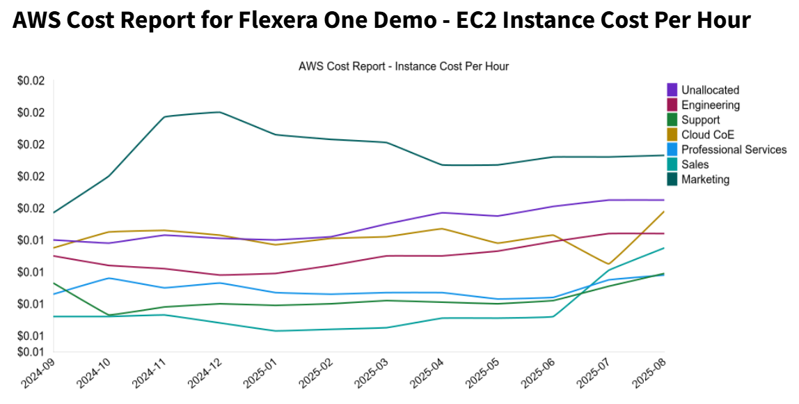

# AWS Cost Report - EC2 Instance Cost Per Hour

## What It Does

This policy template generates a report and chart showing the average AWS EC2 instance cost per hour per month going back a user-specified number of months. Instance costs are normalized to [NFUs (Normalization Factor Units)](https://docs.aws.amazon.com/AWSEC2/latest/UserGuide/ri-modifying.html). Optionally, this report, with chart, can be emailed.

## Example Incident

## Input Parameters

- *Email Addresses* - A list of email addresses to notify.
- *Months Back* - Number of previous months to include in the report
- *Aggregation* - Whether to report the entire organization in aggregate or by Billing Center
- *Allow/Deny Billing Centers* - Whether to treat `Allow/Deny Billing Center List` parameter as allow or deny list. Has no effect if `Allow/Deny Billing Center List` is left empty.
- *Allow/Deny Billing Center List* - A list of allowed or denied Billing Center names/IDs. Leave blank to check all Billing Centers.

## Policy Actions

- Sends an email notification

## Prerequisites

This Policy Template uses [Credentials](https://docs.flexera.com/flexera-one/automation/automation-administration/managing-credentials-for-policy-access-to-external-systems/) for authenticating to datasources -- in order to apply this policy template you must have a Credential registered in the system that is compatible with this policy template. If there are no Credentials listed when you apply the policy template, please contact your Flexera Org Admin and ask them to register a Credential that is compatible with this policy template. The information below should be consulted when creating the credential(s).

- [**Flexera Credential**](https://docs.flexera.com/flexera-one/automation/automation-administration/managing-credentials-for-policy-access-to-external-systems/provider-specific-credentials#flexera) (*provider=flexera*) which has the following roles:
  - `billing_center_viewer`

The [Provider-Specific Credentials](https://docs.flexera.com/flexera-one/automation/automation-administration/managing-credentials-for-policy-access-to-external-systems/provider-specific-credentials) page in the docs has detailed instructions for setting up Credentials for the most common providers.

## Supported Clouds

- AWS

## Cost

This policy template does not incur any cloud costs.
