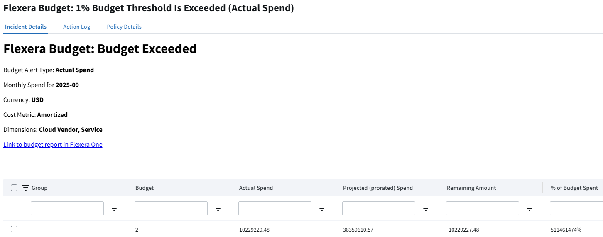

# Budget Alerts

## What It Does

This policy template utilizes Flexera Budgets to detect if budget expense has exceeded its allocated value. The policy template can be run daily to determine if actual or projected spend exceeded the specified threshold.

## Example Incident

## How It Works

- This policy template supports a single target (1 specific Budget). In order to apply a budget alert for multiple budgets, you will need to apply this policy template multiple times.
- Actual expense budget alerts will trigger an incident if the actual budget's spend exceeds the budget threshold
- Forecasted Spend budget alerts will raise an incident when the target's run-rate is on track to exceed the budget threshold
- Data can be grouped by Dimensions.
- The policy template allows the customer to include or exclude unbudgeted spend
- Added a parameter to enable budget tracking for specific dimensions and values.

## Input Parameters

- *Email Addresses* - A list of email addresses to notify
- *Budget Name or ID* - The name or Id of the target Budget.
- *Budget Alert Type* - can be "Actual" or "Forecasted". Actual Spend alerts are based off incurred costs. Forecasted Spend alerts are based off monthly run rates.
- *Degree of Summarization* - Determines if budget should be tracked as a whole or per dimension groups, with possible values of Summarized or By dimensions. The "Summarized" option does not support filtering; if selected, the `Filter Group By Dimension(s)` parameter will have no effect.
- *Filter Group By Dimensions* - Filter by dimension=value pairs. Dimensions are the visible dimensions in the Flexera One platform, such as Cloud Vendor, Resource Type, Service, etc. Values can be comma separated to filter by multiple values for the same dimension. Has no effect if the "Summarized" option is selected for the `Degree of Summarization` parameter. Examples: 'Cloud Vendor=AWS' 'Cloud Vendor Account=001234567890,004321876509' 'Category=Compute'
- *Unbudgeted Spend* - parameter that allows including or excluding unbudgeted funds in the calculation
- *Threshold Percentage* - Threshold to raise the alert if reached

## Policy Actions

- Send an email report

## Prerequisites

This Policy Template uses [Credentials](https://docs.flexera.com/flexera/EN/Automation/ManagingCredentialsExternal.htm) for authenticating to datasources -- in order to apply this policy template you must have a Credential registered in the system that is compatible with this policy template. If there are no Credentials listed when you apply the policy template, please contact your Flexera Org Admin and ask them to register a Credential that is compatible with this policy template. The information below should be consulted when creating the credential(s).

- [**Flexera Credential**](https://docs.flexera.com/flexera/EN/Automation/ProviderCredentials.htm) (*provider=flexera*) which has the following roles:
  - `billing_center_viewer`

The [Provider-Specific Credentials](https://docs.flexera.com/flexera/EN/Automation/ProviderCredentials.htm) page in the docs has detailed instructions for setting up Credentials for the most common providers.

## Supported Clouds

- All

## Cost

This policy template does not incur any cloud costs.
