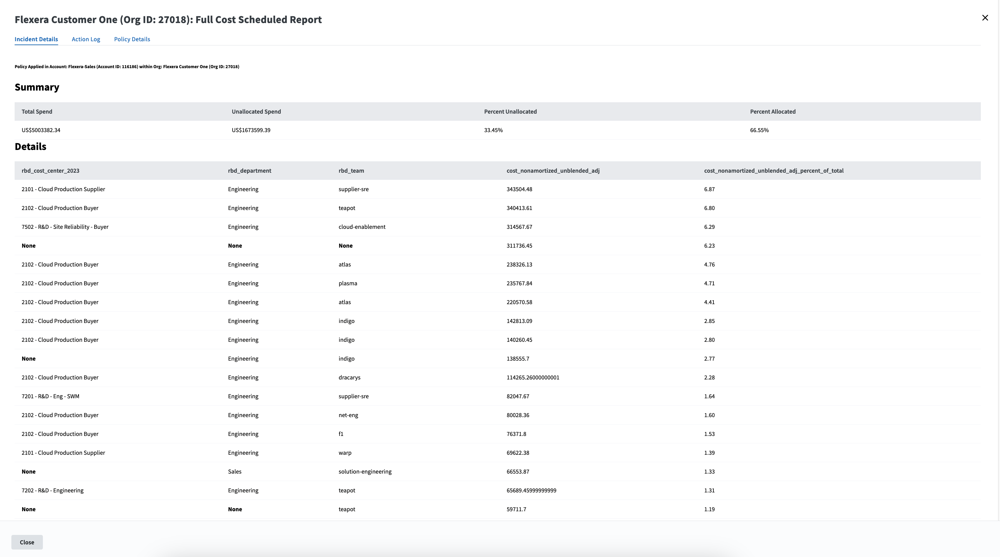

# Scheduled Report for Unallocated Costs

## What It Does

This policy allows you to set up scheduled reports that will provide summaries of cloud cost that are unallocated for the dimensions you specify, delivered to any email addresses you specify.

## Input Parameters

- *Email List* - Email addresses of the recipients you wish to notify
- *Dimensions List* - List of Dimensions you want to report on (i.e. billing_center_id). Must provide at least one dimension
- *Cost Filters* - JSON object (as a string) of filters to apply to the report.  Example: `{\"dimension\": \"vendor\",\"type\": \"equal\",\"value\": \"aws\"}`
- *Cost Metric* - The cost metric for the report
- *Date Range" - Date Range for the Report
- *Filter Report Percent Threshold* - Filter out rows where the cost metric is less than this percentage of the total spend in the report.  Enter 0 to show all rows

## Policy Actions

- Sends an email notification

## Prerequisites

This Policy Template uses [Credentials](https://docs.flexera.com/flexera/EN/Automation/ManagingCredentialsExternal.htm) for authenticating to datasources -- in order to apply this policy you must have a Credential registered in the system that is compatible with this policy. If there are no Credentials listed when you apply the policy, please contact your Flexera Org Admin and ask them to register a Credential that is compatible with this policy. The information below should be consulted when creating the credential(s).

### Credential configuration

For administrators [creating and managing credentials](https://docs.flexera.com/flexera/EN/Automation/ManagingCredentialsExternal.htm) to use with this policy, the following information is needed:

- [**Flexera Credential**](https://docs.flexera.com/flexera/EN/Automation/ProviderCredentials.htm) (*provider=flexera*) which has the following roles:
  - `billing_center_viewer`

The [Provider-Specific Credentials](https://docs.flexera.com/flexera/EN/Automation/ProviderCredentials.htm) page in the docs has detailed instructions for setting up Credentials for the most common providers.

## Supported Clouds

- All

## Cost

This Policy Template does not incur any cloud costs
