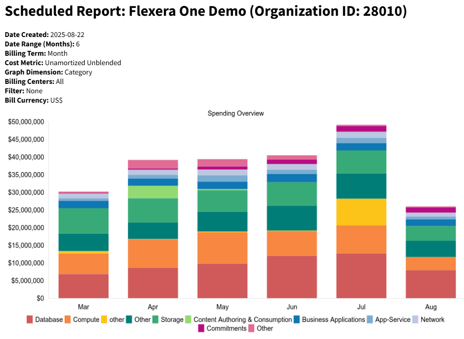

# Scheduled Report

## What It Does

This policy pulls cost data from Flexera CCO (Cloud Cost Optimization) in order to email a report summarizing that data. The report includes a graph showing costs over time as well as a table with the data the graph is built from. The user can alter the contents of the report via parameters.

This policy can be used for automated "reporting" use-cases, as well as "alerting" use-cases. For example, you can set up a scheduled report to be sent every month to show costs over time, or you can set up a scheduled report to be sent only when the percent change in cost exceeds a certain threshold.

*Note: Any cost data that is less than 3 days old will be incomplete. This is because cloud cost data is not imported into Flexera CCO in real time.*

## Example Incident

## Input Parameters

- *Email Addresses* - Email addresses of the recipients you wish to send the scheduled report to.
- *Cost Metric* - Select the cost metric for your report. This determines whether to build the report using amortized or unamortized costs, and whether to blend AWS costs or not.
- *Graph Dimension* - Select which dimension you'd like to be broken out on the graph in the report. Select `Custom` to specify the name of a custom dimension, such as a Custom Tag or Custom Rule-Based Dimension, or the name of any dimension not on the list.
- *Custom Graph Dimension* - Specify the name of the custom dimension you want to break costs out by. Spelling and capitalization must match what is shown in the Flexera CCO platform. Only applicable if `Custom` is selected for the Graph Dimension.
- *Graph Dimension Value Count* - The number of values to display on the graph for the selected dimension. The top N values will be displayed based on the cost metric selected. Enter 0 to display all values. Warning: Displaying all values may result in a graph that is difficult to interpret.
- *Filter Dimensions* - Specify the names of the dimensions you wish to filter the costs by along with their values in dimension=value format. These can be built-in dimensions, Custom Tags or Custom Rule-Based Dimensions. Spelling and capitalization must match what is shown in the Flexera CCO platform. Examples: Environment=Production, Cost Owner=John Doe
- *Filter Functionality* - Whether to filter for costs that meet all of the criteria specified in `Filter Dimensions` or costs that meet any of the criteria. Only applicable if at least two values are entered for `Filter Dimensions`.
- *Date Range (Months)* - Select how many months back you'd like to display on the graph in the report.
- *Ignore Current Month* - Whether or not to ignore the current month and begin reporting from the previous month instead.
- *Billing Term* - Select the unit of time you'd like to display on the graph in the report. The report will split costs along the option selected. For example, if `Week` is selected, the costs will be split out by week along the graph's X axis and in the incident report.
- *Billing Center List* - List of Billing Center Name(s) or ID(s) you want to report on. Leave blank to select all top level Billing Centers.
- *Percent Change Threshold Value* - The threshold (in percent) for the percent change in cost between time period(s) that will trigger the report. Default of 0 will send the report every time based on the applied policy schedule.
- *Percent Change Consecutive Threshold* - The number of consecutive time period(s) where there was a percent change in cost between time period(s) that will trigger the report. Default of `0` will send the report every time based on the applied policy schedule.
- *Percent Change Alert Metric* - The metric to use for the percent change alert. Percent Change from Previous Time Period Daily Average is recommended to normalize between Month periods. This has no affect if Billing Term is set to 'Day'.
- *Percent Change Alert Direction* - Select the direction of percent change that will trigger the report.

## Policy Actions

- Sends an email notification

## Prerequisites

This Policy Template uses [Credentials](https://docs.flexera.com/flexera/EN/Automation/ManagingCredentialsExternal.htm) for authenticating to datasources -- in order to apply this policy you must have a Credential registered in the system that is compatible with this policy. If there are no Credentials listed when you apply the policy, please contact your Flexera Org Admin and ask them to register a Credential that is compatible with this policy. The information below should be consulted when creating the credential(s).

### Credential configuration

For administrators [creating and managing credentials](https://docs.flexera.com/flexera/EN/Automation/ManagingCredentialsExternal.htm) to use with this policy, the following information is needed:

- [**Flexera Credential**](https://docs.flexera.com/flexera/EN/Automation/ProviderCredentials.htm) (*provider=flexera*) which has the following roles:
  - `billing_center_viewer`

The [Provider-Specific Credentials](https://docs.flexera.com/flexera/EN/Automation/ProviderCredentials.htm) page in the docs has detailed instructions for setting up Credentials for the most common providers.

## Supported Clouds

- All

## Cost

This Policy Template does not incur any cloud costs
