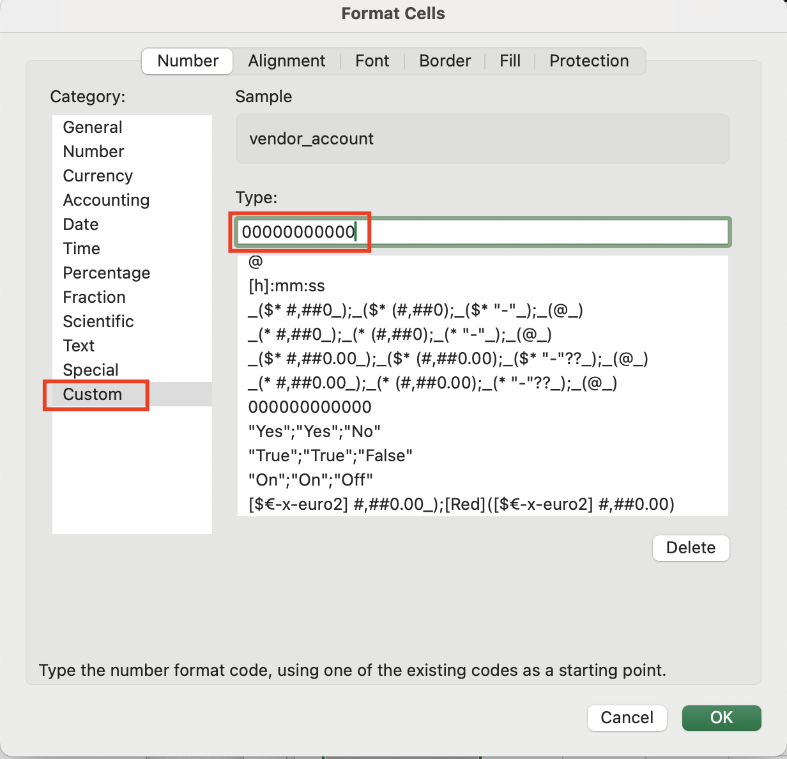

# Rule-Based Dimensions from CSV in Policy Template

## What It Does

This policy creates and updates custom Rule-Based Dimensions based on data provided in CSV format. It allows you to create multiple Rule-Based Dimensions at once using data from a CSV file that maps dimension values to other values that should be used as rules.

> **Important:** There is a **1MB** file size limit for Policy Template files.  If your CSV is larger than this already, please use one of the other methods to transform your CSV into Rule-Based Dimensions

## How It Works

This policy template requires two steps:

1. First, you must update and upload the helper policy template [csv_for_rbds_from_csv.pt](csv_for_rbds_from_csv.pt) with your CSV data. You can use the [example CSV file](csv_for_rbds_example.csv) as a template.

   

1. Then you can apply this policy template (rbds_from_csv.pt) which will read the CSV data from the helper policy template and create/update the Rule-Based Dimensions accordingly.

### CSV Data Format

The CSV data should be formatted as follows:

- The CSV file should have columns for each dimension you want to use as a condition in the rules, and columns for each dimension you want to create as a Rule-Based Dimension.
- The first row should contain the names of the dimensions.
- Each subsequent row should contain the values for each dimension.
- Avoid using `,` commas or tabs in the dimension values, as these are used as delimiters in the CSV file.

#### Multiple Dimensions for Conditions

If using multiple dimensions for conditions (i.e. `vendor_account`,`tag_app_code`), the resulting rule for each row is a logical AND of all dimensions for conditions that have a value in that row.

#### Excel Tips

If using Excel to manage the CSV and the `vendor_account` dimension for conditions, we recommend Formatting the column as "Custom" category with Type "00000000000" (twelve zeros) to avoid Excel converting the AWS account numbers to scientific notation or dropping leading zeros.



### Helper Policy Template Format

The helper policy template [csv_for_rbds_from_csv.pt](csv_for_rbds_from_csv.pt) is used to upload and store the CSV data on the Flexera platform.  Your CSV data should be copied and pasted between the "Begin" and "End" comment blocks in the helper policy template.  Once updated, the helper policy template can be uploaded to the Flexera platform -- there is no need to apply the helper policy template.

```javascript
///////////////////////////////////////////////////////////
//    Copy from Excel and paste BELOW this block         //
///////////////////////////////////////////////////////////
```

... paste your CSV data here ...

```javascript
///////////////////////////////////////////////////////////
//    Copy from Excel and paste ABOVE this block         //
///////////////////////////////////////////////////////////
```

## Input Parameters

This policy has the following input parameters required when launching the policy.

- *Effective Date* - The month and year in YYYY-MM format that you want the rules to apply. This should be left at its default value in most cases to ensure that the rules apply to all costs, including historical costs.
- *Dimensions for Rules* - List of dimension names from your CSV that should be used as conditions in the rules.
- *Dimensions for Rule-Based Dimension Outputs* - List of dimension names from your CSV that should be created as Rule-Based Dimensions.
- *CSV Deliminator* - The character used to separate values in your CSV data. Options are:
  - Tab (copy/paste from Excel)
  - Comma (CSV)
  - Semicolon

## Policy Actions

- Create/update rule-based dimensions

## Prerequisites

This Policy Template uses [Credentials](https://docs.flexera.com/flexera/EN/Automation/ManagingCredentialsExternal.htm) for authenticating to datasources -- in order to apply this policy you must have a Credential registered in the system that is compatible with this policy. If there are no Credentials listed when you apply the policy, please contact your Flexera Org Admin and ask them to register a Credential that is compatible with this policy. The information below should be consulted when creating the credential(s).

- [**Flexera Credential**](https://docs.flexera.com/flexera/EN/Automation/ProviderCredentials.htm) (*provider=flexera*) which has the following roles:
  - `policy_manager`
  - `rule_based_dimensions_manager`

The [Provider-Specific Credentials](https://docs.flexera.com/flexera/EN/Automation/ProviderCredentials.htm) page in the docs has detailed instructions for setting up Credentials for the most common providers.

## Supported Clouds

- Cloud agnostic - works with any cloud provider

## Cost

This policy template does not incur any cloud costs.
