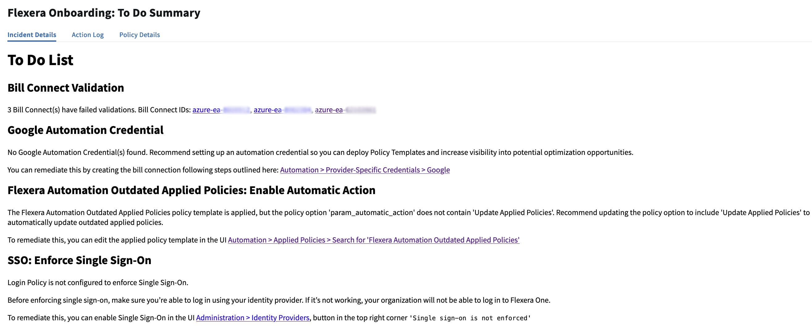

# Flexera Onboarding

## What It Does

This policy checks various configurations in your Organization to ensure that it is set up correctly.  The checks and recommendations are opinionated, and align with recommended best practices for onboarding and productionize your Organization.

## Functional Details

- This policy leverages the Flexera APIs to check various configurations in your Organization.
- All logic related to checks and recommendation criteria is defined in the policy template.

### Example Output

## Input Parameters

- *Email Addresses* - A list of email addresses to send results

## Policy Actions

- Send Email - Sends an email report of the Completed and To Do recommendations
- Apply Recommended Policy Template - Applies the recommended policy template(s) from the Catalog

## Prerequisites

This Policy Template uses [Credentials](https://docs.flexera.com/flexera/EN/Automation/ManagingCredentialsExternal.htm) for authenticating to datasources -- in order to apply this policy you must have a Credential registered in the system that is compatible with this policy. If there are no Credentials listed when you apply the policy, please contact your Flexera Org Admin and ask them to register a Credential that is compatible with this policy. The information below should be consulted when creating the credential(s).

### Credential configuration

For administrators [creating and managing credentials](https://docs.flexera.com/flexera/EN/Automation/ManagingCredentialsExternal.htm) to use with this policy, the following information is needed:

- [**Flexera Credential**](https://docs.flexera.com/flexera/EN/Automation/ProviderCredentials.htm) (*provider=flexera*) which has the following roles:
  - *`org_owner`* - Required for accessing Service Account and Service Account Client details, SSO, and other Org-scoped configurations

The [Provider-Specific Credentials](https://docs.flexera.com/flexera/EN/Automation/ProviderCredentials.htm) page in the docs has detailed instructions for setting up Credentials for the most common providers.
