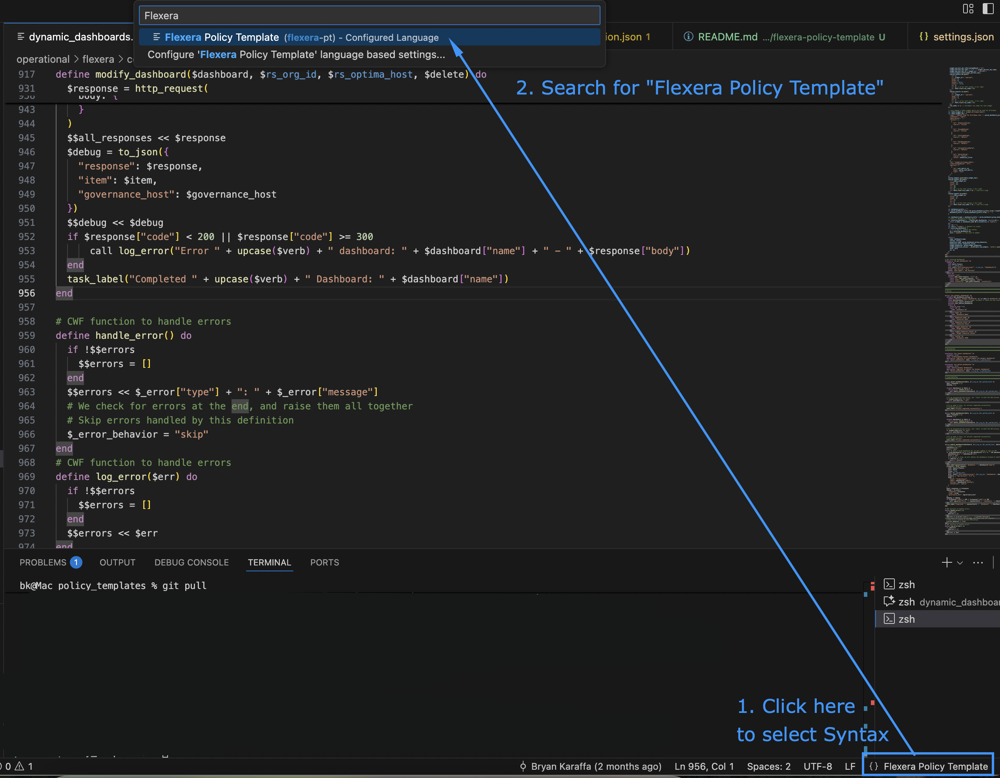

# Flexera Policy Template Language Support

This extension provides syntax highlighting for Flexera Policy Template (`.pt`) files.

## Features

- **Syntax Highlighting** for Policy Template DSL
  - Block definitions (`parameter`, `datasource`, `script`, `policy`, etc.)
  - Metadata fields (`name`, `category`, `severity`, etc.)
  - Template expressions (`{{ }}`)
  - Embedded JavaScript in `script` blocks
  - Policy Template variables (`$param_*`, `$ds_*`, `$$global_*`)
  - Built-in functions (`jmes_path`, `join`, `val`, etc.)

- **Language Configuration**
  - Line comments with `#`
  - Auto-closing pairs for brackets and `do`/`end`
  - Proper bracket matching

## Installation

This is a workspace-local extension. To use it:

1. Open the command palette (Cmd+Shift+P on macOS, Ctrl+Shift+P on Windows/Linux)
1. Type "Developer: Install Extension from Location..."
1. Navigate to this folder (`tools/flexera-policy-template-vscode-extension`)
1. Select the folder

## Usage

Once installed, you can select the "Flexera Policy Template (flexera-pt)" as the Language (bottom right corner)

## How Does It Work

This extension uses TextMate grammars to provide syntax highlighting based on the Flexera Policy Template DSL structure, which combines Ruby-like syntax with embedded JavaScript and template expressions.
