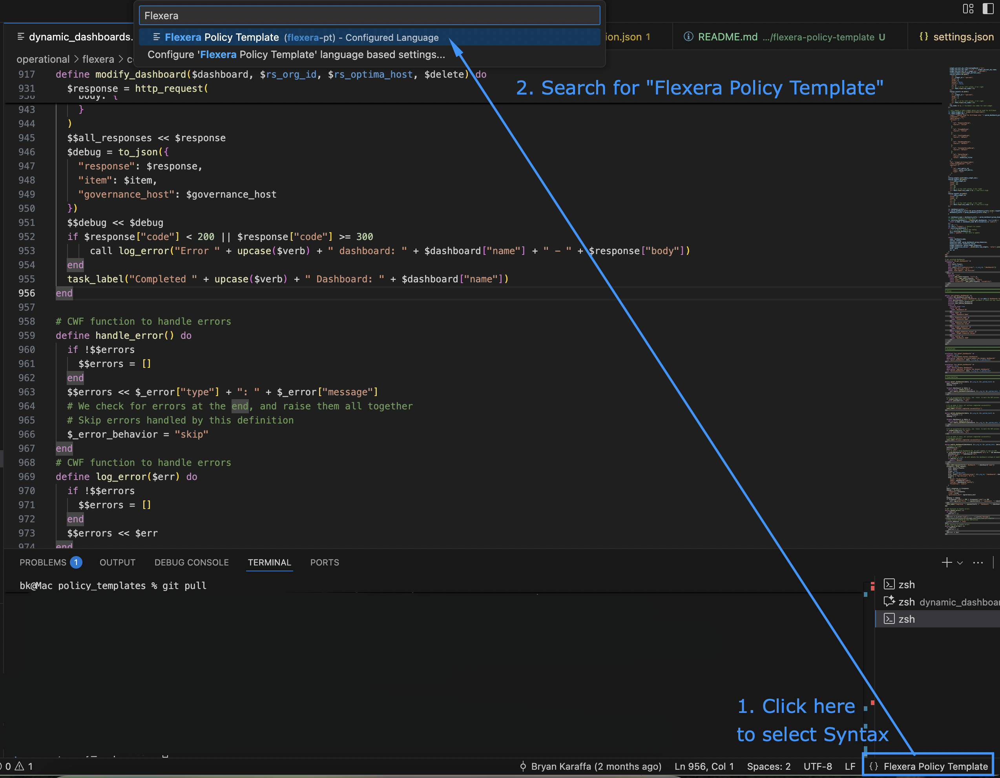

# Flexera Policy Template Language Support

A VSCode extension for developing [Flexera Policy Templates](https://docs.flexera.com/flexera-one/automation/managing-and-using-the-automation-catalog) (`.pt` files) — the custom DSL used to build automation policies for the [Flexera Policy Catalog](https://github.com/flexera-public/policy_templates).

Policy templates combine a Ruby-like block syntax (for datasource definitions, HTTP requests, and policy rules) with embedded JavaScript (for data transformation) and Go template expressions (for incident report rendering). This extension provides full language support for the `.pt` format across all three embedded languages.

## Features

- **Syntax highlighting** for all DSL keywords, functions, variables, embedded JavaScript, and Go template expressions
- **23 code snippets** covering every common policy template construct (`pt-header`, `pt-param`, `pt-creds-*`, `pt-datasource-*`, `pt-policy`, `pt-escalation-*`, `pt-define`, and more)
- **Auto-indentation** after `do`/`then` and smart dedent before `end`
- **Auto-closing pairs** for brackets and quotes
- **Smart word selection** for `$`-prefixed DSL variables
- **Code folding** for `do`/`end` blocks and `###` section dividers

## Installation

### Option A — Install from Location (Recommended for Development)

1. Open the command palette (`Cmd+Shift+P` on macOS, `Ctrl+Shift+P` on Windows/Linux)
2. Type **Developer: Install Extension from Location...**
3. Navigate to and select the `tools/flexera-policy-template-vscode-extension/` folder
4. Reload the window when prompted

### Option B — Install from VSIX Package

```bash
# Build the package (requires vsce: npm install -g @vscode/vsce)
cd tools/flexera-policy-template-vscode-extension
vsce package

# Install the generated .vsix
code --install-extension flexera-policy-template-*.vsix
```

### Option C — Developer Symlink (Live Reload)

For grammar development, symlink the extension directory into VSCode's extensions folder so grammar changes take effect after a window reload:

```bash
ln -s "$(pwd)/tools/flexera-policy-template-vscode-extension" ~/.vscode/extensions/flexera-policy-template
```

Then use **Developer: Reload Window** (`Cmd+Shift+P` → Reload Window) to pick up grammar changes without reinstalling.

## Usage

Once installed, `.pt` files are automatically detected and highlighted. If a file isn't highlighted, click the language selector in the bottom-right corner of the VSCode status bar and choose **Flexera Policy Template**.

[](flexera-pt-vscode.png)

### Using Snippets

In any `.pt` file, type a snippet prefix (e.g. `pt-header`) and press `Tab` to expand it. Use `Tab` to move between placeholders and `Shift+Tab` to go back.

## Requirements

- VSCode 1.60.0 or later
- No other extensions required

---

## Syntax Highlighting Reference

Comprehensive highlighting for the Flexera Policy Template DSL:

- **Top-level block keywords** — `parameter`, `credentials`, `pagination`, `datasource`, `script`, `policy`, `escalation`, `define`
- **Block property keywords** — `request`, `result`, `validate`, `validate_each`, `check`, `export`, `escalate`, `email`, `collect`, `field`, `header`, `query`, `body`, `body_field`, `auth`, `host`, `path`, `iterate`, `run_script`, `pagination`, `get_page_marker`, `set_page_marker`, `uri`, `no_echo`, `min_value`, `max_value`, `min_length`, `max_length`, `allowed_values`, `allowed_pattern`, `resolve_incident`, `attach_export_table`, `body_table_max_rows`, and more
- **Cloud Workflow keywords** — `foreach`, `concurrent`, `while`, `sub`, `call`, `retrieve`, `sleep`, `timeout`, `on_timeout`, `on_error`, `raise`, `return`
- **Built-in DSL functions** — `jmes_path`, `xpath`, `val`, `join`, `split`, `size`, `contains`, `eq`, `ne`, `gt`, `lt`, `gte`, `lte`, `logic_and`, `logic_or`, `logic_not`, `get`, `switch`, `first`, `last`, `to_n`, `to_s`, `to_json`, `type`, `inspect`, `task_label`, `http_request`, `http_get`, `http_post`, `http_put`, `http_patch`, `http_delete`
- **Runtime variables** — `rs_org_id`, `rs_org_name`, `rs_project_id`, `rs_project_name`, `rs_optima_host`, `rs_governance_host`, `f1_app_host`, `meta_parent_policy_id`, `policy_id`
- **Implicit DSL context variables** — `response`, `iter_item`, `col_item`, `item`, `data`
- **Cloud Workflow special variables** — `$_error`, `$_error_behavior`
- **`info()` field names** — `version`, `provider`, `service`, `policy_set`, `recommendation_type`, `hide_skip_approvals`, `publish`
- **Policy Template variable sigils** — `$param_*`, `$ds_*`, `$js_*`, `$auth_*`, `$$global_*`, `$pagination_*`
- **Embedded JavaScript** — full JS syntax highlighting inside `code <<-'EOS' ... EOS` script blocks and single-line `code '...'` expressions
- **Go template expressions** — `{{ }}` blocks highlighted inside `detail_template` and `summary_template` heredocs
- **String types** — double-quoted strings, single-quoted strings, heredocs (`<<-'EOS'` / `<<-EOS`)
- **Comments** — line comments (`#`) and block comments (`###...###`)

## Snippets Reference

23 snippets for common policy template patterns, triggered by typing the prefix and pressing Tab:

| Prefix | Description |
| --- | --- |
| `pt-header` | Complete policy template header block |
| `pt-param` | Generic parameter block |
| `pt-param-string` | String parameter with `allowed_values` |
| `pt-param-list` | List parameter |
| `pt-param-number` | Number parameter with `min_value`/`max_value` |
| `pt-creds-aws` | AWS credentials block |
| `pt-creds-azure` | Azure Resource Manager credentials block |
| `pt-creds-google` | Google Cloud credentials block |
| `pt-creds-flexera` | Flexera credentials block |
| `pt-pagination-azure` | Azure `nextLink` pagination |
| `pt-pagination-aws` | AWS `NextToken` pagination |
| `pt-pagination-google` | Google `pageToken` pagination |
| `pt-datasource-request` | Datasource with HTTP GET request |
| `pt-datasource-iterate` | Datasource that iterates a list |
| `pt-datasource-script` | Datasource with `run_script` transform |
| `pt-script` | JavaScript script block |
| `pt-policy` | Policy block with `validate_each` |
| `pt-escalation-email` | Email escalation block |
| `pt-escalation-action` | Action escalation with `run` |
| `pt-define` | Cloud Workflow `define` block with error handling |
| `pt-ds-applied-policy` | `ds_applied_policy` boilerplate datasource |
| `pt-ds-flexera-api-hosts` | `ds_flexera_api_hosts` boilerplate datasource |
| `pt-ds-azure-subscriptions` | `ds_azure_subscriptions` boilerplate datasource |

## How It Works

The extension uses a [TextMate grammar](https://macromates.com/manual/en/language_grammars) (`syntaxes/flexera-pt.tmLanguage.json`) to tokenize `.pt` files into named scopes. VSCode themes then apply colors to those scopes. The grammar handles the multi-language nature of `.pt` files by embedding the `source.js` grammar inside `code <<-'EOS' ... EOS` script blocks and inside `code '...'` inline expressions.

Go template expressions (`{{ }}`) inside `detail_template` and `summary_template` heredocs are highlighted by a separate `dsl-string-heredoc` rule that takes precedence over the JavaScript heredoc rule in those contexts.
